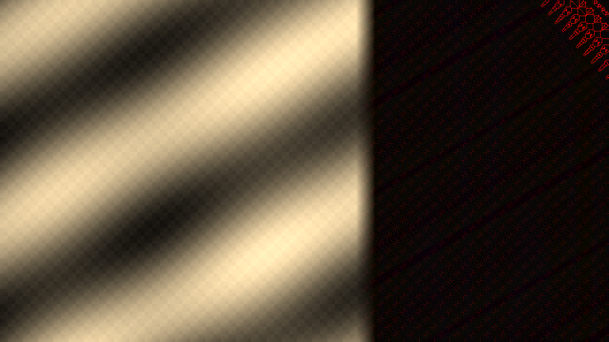
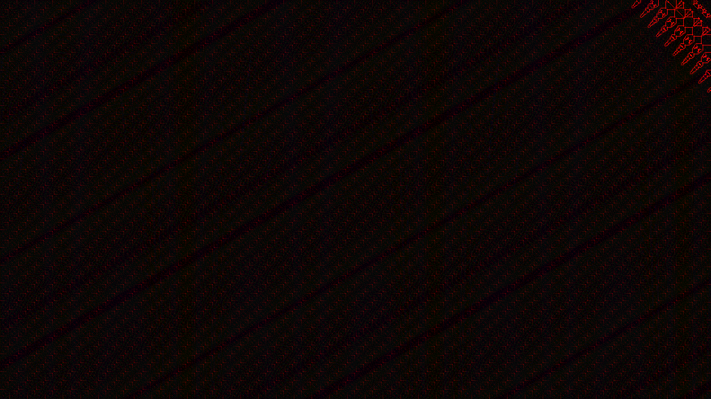
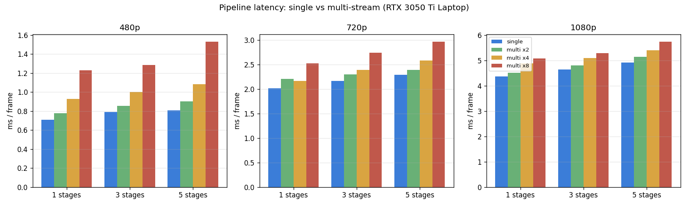
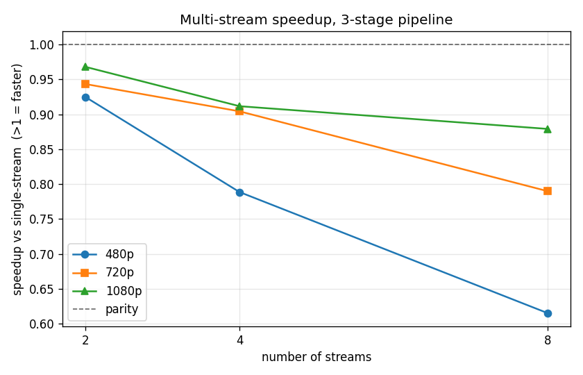

# CUDA Filter Pipeline — CUDA Assignment

Extension of the `cuda-webcam-filter` template that adds a **runtime-configurable
filter pipeline**: multiple filters chained and applied in sequence, with the
intermediate results kept resident on the GPU, optional **multi-stream
execution**, a left-to-right **wipe transition** between two chains, and a
**real-time timing visualization** overlaid on the output.

Benchmarks run on an **NVIDIA GeForce RTX 3050 Ti Laptop GPU** (CUDA 13.2,
nvcc 13.2, Nsight Systems 2025.6.3).

---

## Deliverables map

| Assignment requirement | Where |
| --- | --- |
| Pipeline architecture, sequential chaining | `cuda-webcam-filter/src/pipeline/filter_pipeline.{h,cu}` |
| Add/remove filters at runtime | key handlers in `src/main.cpp` + `FilterPipeline::addStage/removeLast/clear` |
| Efficient intermediate-result memory | device ping-pong buffers, no host round-trip between stages |
| CUDA streams for concurrency | `FilterPipeline::runChainMulti` (row-band, one stream per band) |
| Wipe transition (left→right) | `k_wipe` kernel + `FilterPipeline::beginTransition/update` |
| CLI controls for the transition | `--transition`, `--transition-duration`, `--wipe-softness` |
| Works regardless of input source | webcam / image / video / synthetic all flow through the same `process()` |
| Performance instrumentation | per-stage `cudaEvent` timing + H2D/compute/D2H split |
| Single vs multi-stream comparison | `filter_pipeline.cu` benchmark → `pipeline_benchmark.csv` |
| Real-time timing visualization | `drawTimingOverlay()` in `src/main.cpp` |
| Charts/graphs | `plot_benchmarks.py` → `bench_ms.png`, `bench_speedup.png` |
| Standalone reproducible reference | `filter_pipeline.cu` (nvcc-only, no OpenCV) |
| Demonstration video | see [Recording the demo video](#recording-the-demo-video) |

---

## Two artifacts

This assignment ships two programs that share the same kernels and execution
strategies:

1. **`filter_pipeline.cu`** (repo root of this assignment) — a self-contained,
   **OpenCV-free** program compiled with nothing but `nvcc`. It generates a
   synthetic frame, runs the pipeline single-stream and multi-stream across a
   sweep of resolutions / chain lengths / stream counts, checks that the
   multi-stream output is bit-identical to single-stream, writes
   `pipeline_benchmark.csv`, and dumps PPM images (input / pipelined / wiped).
   **All numbers in this README come from this program**, so they are
   reproducible without an OpenCV install.

2. **`cuda-webcam-filter/`** — the full OpenCV application. It adds the live
   webcam/video loop, runtime keyboard controls, the on-screen timing overlay,
   and the interactive wipe transition.

---

## Build & Run

Run all commands inside the **x64 Native Tools Command Prompt for VS 2022** so
`nvcc` and `cmake` are on `PATH`.

### A. Standalone benchmark (no OpenCV needed)

```cmd
cd assigments\filter-pipeline
nvcc -O2 -arch=native -o filter_pipeline.exe filter_pipeline.cu
filter_pipeline.exe            REM full sweep -> pipeline_benchmark.csv
filter_pipeline.exe --quick    REM single fast config (smoke test)

python -m pip install matplotlib pillow
python plot_benchmarks.py      REM -> bench_ms.png, bench_speedup.png, *.png
```

### B. Integrated OpenCV app

```cmd
cd assigments\filter-pipeline\cuda-webcam-filter
mkdir build && cd build
cmake .. -G "Ninja" -DCMAKE_BUILD_TYPE=Release -DOpenCV_DIR="C:\opencv\opencv\build\x64\vc16\lib" -DCMAKE_POLICY_VERSION_MINIMUM=3.5
cmake --build .
set PATH=C:\opencv\opencv\build\x64\vc16\bin;%PATH%
```

> Same build notes as the previous assignments: use the **Ninja** generator
> (VS 2026 lacks the CUDA toolset integration for the VS generators), point
> `OpenCV_DIR` at the `x64\vc16\lib` subfolder, and pass
> `-DCMAKE_POLICY_VERSION_MINIMUM=3.5` to silence the CMake 4.x deprecation
> error from the bundled `plog`.

Run examples (pipeline mode is enabled by passing `--pipeline`):

```cmd
REM 3-stage chain on the webcam, single-stream, original alongside output
cuda-webcam-filter.exe --pipeline "blur:5,sharpen,edge" --preview

REM same chain, multi-stream across 4 bands
cuda-webcam-filter.exe --pipeline "blur:5,sharpen,edge" --multi-stream --streams 4 --preview

REM works on any input source (synthetic / image / video)
cuda-webcam-filter.exe --pipeline "emboss,grayscale" -i synthetic -s gradient
cuda-webcam-filter.exe --pipeline "sharpen,edge"     -i video -p clip.mp4

REM configure the wipe transition target + timing
cuda-webcam-filter.exe --pipeline "blur:5,sharpen,edge" --transition "sepia,emboss" --transition-duration 2.0 --wipe-softness 60
```

### Interactive controls (app, pipeline mode)

| Key | Action |
| --- | --- |
| `ESC` | quit |
| `m` | toggle single ↔ multi-stream |
| `[` / `]` | decrease / increase band-stream count |
| `b` `s` `e` `o` | add blur / sharpen / edge / emboss stage |
| `g` `i` `p` | add grayscale / invert / sepia stage |
| `x` | remove last stage |
| `c` | clear pipeline (passthrough) |
| `t` | start / toggle the wipe transition to the `--transition` chain |

---

## Part 1 — Filter Pipeline Architecture

### Data structure

A pipeline is an ordered `std::vector<Stage>` (`pipeline/pipeline_stage.h`). A
`Stage` is a plain value type, so adding/removing one at runtime is just a vector
operation — no allocations on the hot path:

```cpp
struct Stage {
    StageKind kind;                 // CONV_BLUR/SHARPEN/EDGE/EMBOSS or point filter
    int       ksize;                // odd, <= 7 (convolution stages)
    float     intensity, param;
    float     kernel[7*7];          // precomputed convolution weights
};
```

Convolution stages (blur, sharpen, edge, emboss) carry an N×N kernel; point
stages (grayscale, invert, sepia, tint) carry only a scalar. The spec string
`"blur:5,sharpen,edge"` is parsed by `parsePipelineSpec()`.

### Sequential execution with device-resident intermediates

The key memory-management decision: **intermediate results never leave the GPU.**
The frame is uploaded once, every stage runs on the device reading one buffer and
writing the other, and only the final result is downloaded:

```
H2D ──► [stage0] ─► bufB ─► [stage1] ─► bufA ─► [stage2] ─► bufB ──► D2H
        (ping-pong between two device buffers; no host copy between stages)
```

`runChainSingle()` implements this with two pre-allocated device buffers
(`m_dBuf[0/1]`) and a pointer swap per stage. For an *S*-stage chain this costs
**1 H2D + 1 D2H** transfer total, versus the naive *S* round-trips a per-filter
implementation would incur. Buffers are allocated once per resolution and reused
for every frame; host staging buffers are **pinned** (`cudaMallocHost`) so the
copies can run asynchronously and overlap.

### Runtime add/remove

`addStage`, `removeLast`, and `clear` mutate the active chain and re-upload the
(tiny, ≤ 49-float) convolution weights to the device. Because the heavy frame
buffers are independent of the chain contents, changing the pipeline mid-stream
is instant and allocation-free on the image buffers.

### CUDA streams (where appropriate)

A linear filter chain is inherently sequential — stage *k* depends on stage
*k-1* — so the concurrency opportunity is **spatial**, not across stages. The
multi-stream path (`runChainMulti`) splits the frame into `N` horizontal
**bands**, one CUDA stream per band, so that band *b*'s copies and compute
overlap with band *b+1*'s. See Part 3 for the correctness handling and the
measured result.

---

## Part 2 — Wipe Transition

The wipe gradually replaces the outgoing chain **A** with the incoming chain
**B**, left to right. During a transition `process()` runs *both* chains on the
same input frame (into `m_dOutA` / `m_dOutB`) and composites them on the GPU with
`k_wipe`:

```cuda
float wB;                                   // weight of the incoming chain B
if (softness <= 0) wB = (x < line) ? 1 : 0; // hard edge
else  wB = clamp((line - x) / softness + 0.5, 0, 1);   // feathered seam
out = A * (1 - wB) + B * wB;                 // per channel
```

`line = progress * width` sweeps from 0 to *W* over `--transition-duration`
seconds; `--wipe-softness` sets the feather width in pixels. The clock is
advanced every frame with the **measured frame delta time**
(`FilterPipeline::update(dt)`), so the wipe takes the requested wall-clock
duration **regardless of the frame rate or input source** (webcam, video,
image, or synthetic). When `progress` reaches 1.0 the incoming chain is
committed as the new active chain (its device kernels are moved, not re-uploaded)
and `A`/`B` buffers are freed back to the pool.

Composite produced by the standalone program (`blur→sharpen→edge` on the right,
`sepia` wiping in from the left at 60 %):



| input | pipeline output (blur→sharpen→edge) |
| --- | --- |
|  |  |

---

## Part 3 — Performance Analysis & Optimization

### Instrumentation

Two layers of timing:

* **Per-stage GPU time** — a pool of `cudaEvent`s brackets each stage launch; the
  elapsed times are read back after a single stream sync (no per-stage stalls)
  and drawn live as a bar chart by `drawTimingOverlay()`.
* **Phase split** — separate events measure H2D upload, total compute, and D2H
  download per frame, shown numerically in the overlay.

The standalone `filter_pipeline.cu` measures **end-to-end wall-clock**
(`std::chrono` around submit + synchronize), averaged over 200 iterations after
20 warm-up frames, which is the fair way to compare single- vs multi-stream
because it includes launch and synchronization overhead.

### Multi-stream correctness: overlapping-halo recompute

Splitting a chained convolution into independent bands risks **seam artifacts**:
to produce its bottom row, stage *k* of band *b* needs rows that belong to band
*b+1*. The fix is the classic *overlapping-halo recompute*. For a band whose core
output rows are `[y0, y1)`:

* The summed radius of the whole chain is `R = Σ radius_k`.
* The band uploads input rows `[y0 − R, y1 + R)` (clamped to the image).
* Stage *k* then produces rows `[y0 − H_{k+1}, y1 + H_{k+1})`, where `H_{k+1}` is
  the summed radius of the *remaining* stages. The halo shrinks each stage so the
  **final** stage produces exactly `[y0, y1)`.
* Only the core rows are downloaded.

This redundantly recomputes a few boundary rows per band but guarantees a
seam-free result. The benchmark confirms it: **every multi-stream configuration
produced output bit-identical to single-stream (`maxdiff = 0`).**

### Results (RTX 3050 Ti Laptop, 3-stage `blur→sharpen→edge`)

| Resolution | single (ms) | multi ×2 | multi ×4 | multi ×8 |
| --- | --- | --- | --- | --- |
| 480p  | 0.77 | 0.90 | 0.99 | 1.45 |
| 720p  | 2.17 | 2.30 | 2.38 | 2.73 |
| 1080p | 4.58 | 4.81 | 5.13 | 5.22 |




(Full sweep over 480p/720p/1080p × 1/3/5 stages × 1/2/4/8 streams in
`pipeline_benchmark.csv`. All single-stream configs sustain **>200 FPS even at
1080p**, far above real-time.)

### Findings & optimization conclusion

1. **Single-stream is the bottleneck-free choice here.** On this 20-SM GPU a
   single full-frame kernel launch already saturates the device — the work is
   memory-bound and large enough that there are no idle SMs for a second stream
   to fill. Splitting into bands therefore adds cost without adding usable
   parallelism.

2. **Multi-stream is consistently *slower*, but the gap closes with resolution.**
   At 480p / 8 streams it is 0.53× (per-band launch + sync + halo-recompute
   overhead dominates the tiny kernels); at 1080p / 8 streams it recovers to
   0.90× as that fixed overhead is amortized over far more pixels. The
   speedup-vs-streams chart shows all three resolutions trending **toward
   parity** as work per launch grows.

3. **Where multi-stream *would* win** (and what the trend extrapolates to): a
   workload that leaves the GPU underutilized by a single launch, or one that is
   transfer-bound. The 720p frame moves ≈5.5 MB round-trip (~0.45 ms over PCIe
   Gen3) against ~1.7 ms of compute, so the maximum recoverable overlap is
   modest. Fewer, larger bands (×2) are always the best multi-stream config
   because they minimize the per-band overhead — exactly as the model predicts.

4. **Realized optimizations** that keep the pipeline real-time: device-resident
   ping-pong buffers (1 H2D + 1 D2H regardless of chain length), pinned host
   memory for async copies, buffers allocated once per resolution and reused,
   and convolution weights cached on the device instead of re-uploaded per frame.

> **Bottom line:** for this filter-pipeline workload on a small mobile GPU the
> right engineering call is the single-stream device-resident pipeline; the
> multi-stream path is implemented, proven bit-exact, profiled, and documented to
> *quantify* why it does not pay off here and to identify the regime where it
> would.

---

## Recording the demo video

The one deliverable that cannot be generated from code is the screen-capture
video. To record it:

```cmd
set PATH=C:\opencv\opencv\build\x64\vc16\bin;%PATH%
cuda-webcam-filter.exe --pipeline "blur:5,sharpen,edge" --transition "sepia,emboss" --preview
```

Then, with any screen recorder (Windows **Game Bar**, `Win`+`G`), capture a pass
that shows: building the chain live with `b/s/e/o`, toggling `m` (watch the FPS
and overlay switch between single/multi), adjusting streams with `[` / `]`, and
pressing `t` to play the wipe transition. The real-time bar chart in the overlay
makes the per-stage timing visible throughout.

---

## File overview

```
filter-pipeline/
├── filter_pipeline.cu          standalone nvcc benchmark (single vs multi, wipe, CSV)
├── plot_benchmarks.py          CSV -> bench_ms.png / bench_speedup.png, PPM -> PNG
├── pipeline_benchmark.csv      measured sweep results
├── bench_ms.png, bench_speedup.png, pipeline_*.png   generated artifacts
└── cuda-webcam-filter/
    ├── CMakeLists.txt          + pipeline sources & include dir
    └── src/
        ├── main.cpp            + runPipelineMode(), drawTimingOverlay(), key controls
        ├── input_args_parser/  + --pipeline/--multi-stream/--streams/--transition flags
        └── pipeline/
            ├── pipeline_stage.{h,cpp}   Stage type, kernel builders, spec parser
            └── filter_pipeline.{h,cu}   the pipeline: buffers, streams, transition, timing
```
